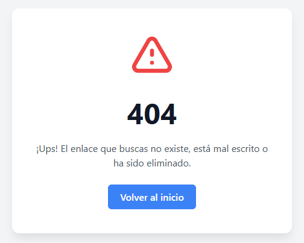
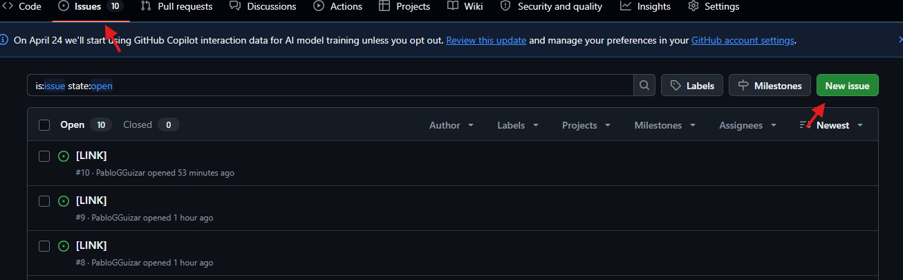
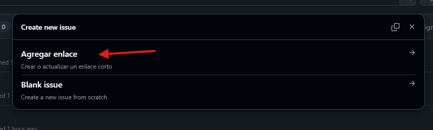
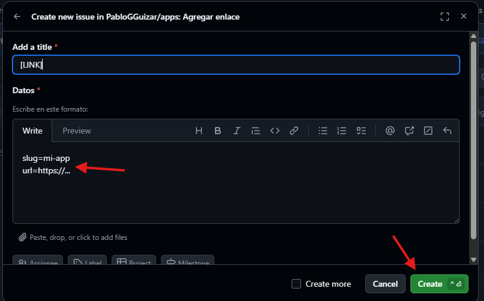

# **🔗 Redireccionador de Enlaces y Página Personal (Serverless)**

Un sistema híbrido ligero y sin servidor alojado en GitHub Pages. Funciona como una **página de perfil (estilo Linktree)** y como un **motor de redirección de URLs cortas**, automatizado completamente a través de GitHub Actions y GitHub Issues.

 

## **🚀 ¿Cómo funciona?**

Esta aplicación utiliza la arquitectura estática de GitHub Pages dividiendo el trabajo en dos archivos principales:

1. **La Página Principal (index.html):** Cuando los usuarios visitan la raíz de tu sitio (ej. tusitio.com/apps/), ven una página de perfil moderna con tus enlaces principales estáticos y un menú desplegable que lee dinámicamente tu base de datos de enlaces.  
2. **El Motor de Redirección (404.html):** Cuando un usuario ingresa a un enlace corto (ej. tusitio.com/apps/mi-link), GitHub no encuentra la carpeta y recurre al archivo 404.html. Este script captura el *slug* de la URL, consulta la base de datos links.json y redirige automáticamente a la URL de destino. Si no existe, muestra un mensaje de error 404 amigable.

## **⚙️ Gestión de Enlaces (Añadir, Editar o Eliminar)**

No es necesario editar el código fuente ni el archivo links.json manualmente para gestionar tus redirecciones cortas. Todo se hace mediante **GitHub Issues**.

### **Para agregar o actualizar un enlace corto:**

1. Ve a la pestaña de **Issues** en este repositorio.  
2. Haz clic en **New Issue** y selecciona la plantilla **"Agregar enlace"**.  
3. En la descripción, llena los datos con el siguiente formato:  
   slug=nombre-de-tu-enlace  
   url=https://la-url-de-destino.com

4. Haz clic en **Submit new issue**.  
5. ¡Listo\! Un flujo de trabajo de GitHub Actions (update-links.yml) leerá tu issue, actualizará links.json, hará el commit y cerrará el issue automáticamente.

### **Para eliminar un enlace corto:**

Sigue los mismos pasos anteriores, pero **deja la variable url en blanco**:

slug=nombre-del-enlace-a-borrar  
url=

El flujo de trabajo detectará que la URL está vacía y eliminará la entrada de la base de datos.

## **🎨 Personalización de la Página de Inicio**

El archivo index.html está construido con Tailwind CSS para ser altamente estético. Para hacerlo tuyo, edita directamente el archivo HTML:

* **Foto de perfil:** Busca la etiqueta \ y cambia el atributo src por la URL de tu avatar.  
* **Textos:** Modifica las etiquetas \<h1\> y \<p\> para cambiar tu nombre y biografía.  
* **Redes sociales:** Actualiza las etiquetas \<a\> estáticas con los enlaces a tu GitHub, LinkedIn, Telegram, etc.

## **📂 Estructura del Proyecto**

* index.html: Página de presentación interactiva (tu portafolio/Linktree).  
* 404.html: Script de redirección ("atrapa-todo") y diseño visual de error para enlaces no encontrados.  
* links.json: El diccionario/base de datos que mapea los slugs con sus URLs de destino.  
* .github/workflows/update-links.yml: La automatización (GitHub Action) que modifica el archivo JSON al abrir un Issue.  
* .github/ISSUE\_TEMPLATE/add-link.yml: La plantilla preconfigurada para la creación de issues.

## **🛠️ Requisitos e Instalación**

Para replicar este proyecto en tu propio repositorio:

1. Asegúrate de tener habilitado **GitHub Pages** apuntando a la rama principal.  
2. Otorga permisos de escritura a las GitHub Actions. Ve a Settings \> Actions \> General \> Workflow permissions y selecciona **Read and write permissions**. Esto es vital para que el bot pueda actualizar los enlaces.  
3. Ajusta las rutas base (los /apps/) en los archivos index.html y 404.html si decides alojar este proyecto en la raíz absoluta de tu dominio en lugar de una subcarpeta.
